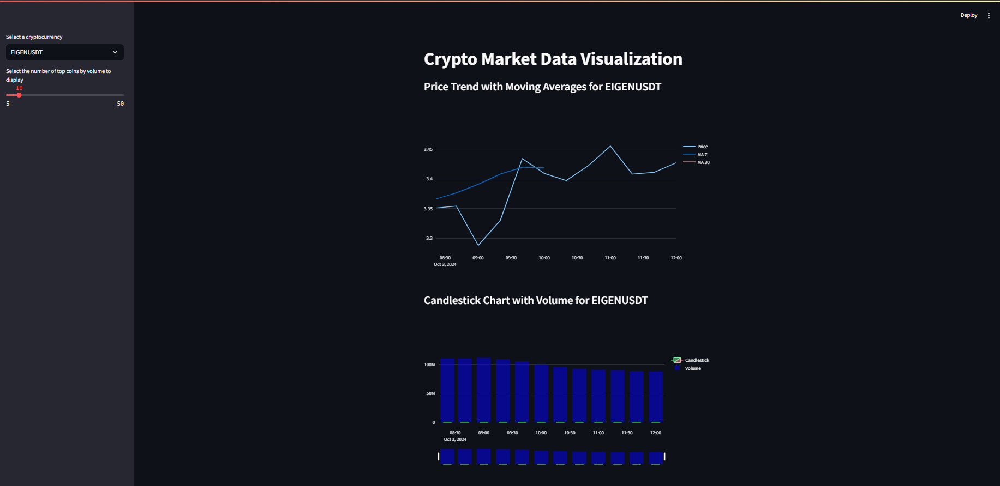
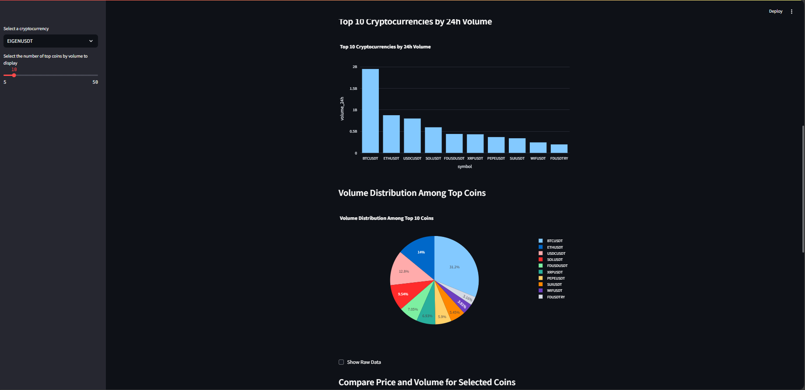

# Crypto Trading Analysis and Visualization Pipeline

## 📈 Project Overview

This project is an **end-to-end data pipeline** for analyzing cryptocurrency trading data. It fetches real-time data from the Binance API, cleans the data, stores it in a PostgreSQL database, and visualizes key insights using an interactive **Streamlit dashboard**. The dashboard provides powerful visualizations for price trends, volume analysis, and correlation between different cryptocurrencies.

The goal of the project is to enable **data-driven decision-making** in the cryptocurrency market by providing insightful visualizations that help traders and analysts identify trends, correlations, and anomalies in market data. The project can be expanded into machine learning applications for predicting price movements and discovering trading patterns.

---

## 🛠 Tools & Technologies

This project utilizes a range of modern tools and technologies to ensure smooth and efficient data flow and visualization.

- **Airflow**: Used to orchestrate and automate the pipeline, including data extraction from the Binance API and data cleaning before storage.
- **PostgreSQL**: Serves as the database to store cleaned and structured cryptocurrency data, enabling fast querying and analysis.
- **Docker**: Provides containerized environments for seamless deployment and scalability across different systems.
- **Streamlit**: An interactive web framework that visualizes real-time data, enabling easy exploration of price trends, volume analysis, and correlations between cryptocurrencies.
- **Plotly**: Provides powerful, interactive charts for advanced data visualization.
- **Python (Pandas, Numpy, Sklearn)**: For data manipulation, clustering, and processing before storing it in the database.

---

## 📊 Key Visualizations

- **Price Trends with Moving Averages**: Visualizes historical prices of selected cryptocurrencies with moving average overlays to highlight trends and potential reversals.
- **Correlation Heatmap**: Displays correlations between multiple cryptocurrencies, helping traders identify coins that move together.
- **Candlestick Chart**: Detailed candlestick charts show open, high, low, and close prices over time, along with volume bars for deeper market insights.
- **Volume Comparison**: A bar chart and pie chart for comparing the trading volume of the top coins by volume, providing insights into market activity.

---

## 🛠️ How to Set Up the Project

### Prerequisites

Make sure you have the following installed on your system:
- **Docker** & **Docker Compose**
- **Python 3.8+**
- **pip** (Python package manager)

### 1. Clone the Repository

```bash
git clone https://github.com/your-username/crypto-trading-analysis.git
cd crypto-trading-analysis
```

### 2. Set Up the Environment
Create a .env file in the root directory and add your environment variables for PostgreSQL:

```bash
POSTGRES_USER=******
POSTGRES_PASSWORD=******
DB_NAME=******
```

### 3. Build and Run Docker Containers
The project uses Docker Compose to manage Airflow, PostgreSQL, and the Streamlit web app. Start the containers with:

```bash
docker-compose up -d
```

This will:
* Launch Airflow to orchestrate data pipelines.
* Launch PostgreSQL as the database.
* Set up the Streamlit application.

### 4. Set Up Airflow
Access Airflow on http://localhost:8081 (or the port you've configured):

Log in with the default Airflow credentials (username: airflow, password: airflow).
Trigger the DAG responsible for data collection and cleaning.
Monitor the status of data pipelines from the Airflow interface.

### 5. Access the Streamlit Dashboard
Once the data pipelines have run successfully, navigate to http://localhost:8501 to access the Streamlit dashboard, where you can explore and visualize the cryptocurrency data.




